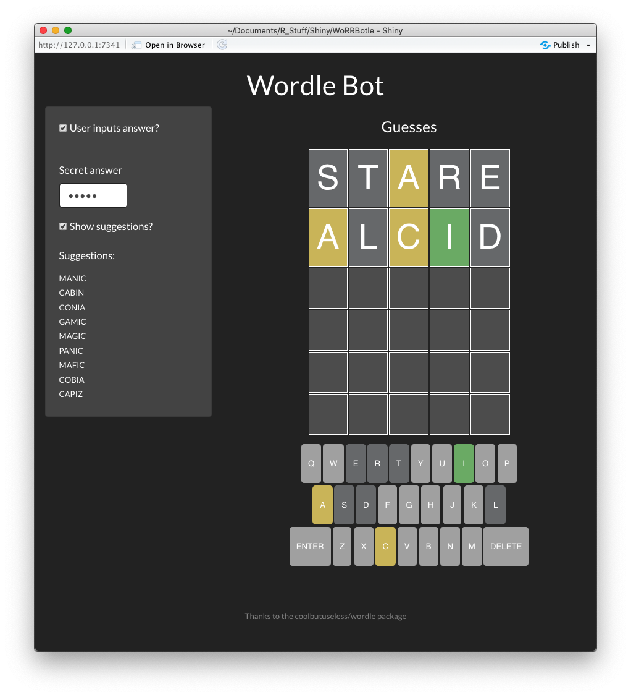

README
================

<!-- README.md is generated from README.Rmd. Please edit that file -->

# WoRRBotle

<!-- badges: start -->


<!-- badges: end -->

**WoRRBotle** is a Shiny wordle bot. It allows you to play wordle using
either a word chosen by the bot or a word you choose – which is not much
of a puzzle, but is good for testing your strategy. The goal is for it
to present a list of words which are possible choices given the guesses
so far.

This was written just as an exercise in Shiny but holy smokes, I am
learning a lot about improving Shiny interfaces, R Markdown, and open
source in the course of doing it.

This is intended to use the coolbutuseless/wordle package, which you can
install from [GitHub](https://github.com/coolbutuseless/wordle) with:

``` r
# install.packages('remotes')
remotes::install_github('coolbutuseless/wordle')
```



Sample screen shot as of Feb. 3, 2022
